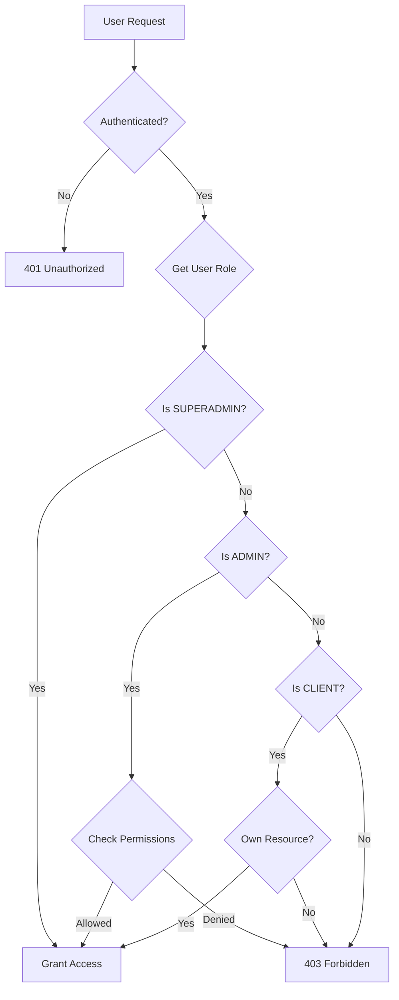

# Permission System Documentation

## Overview

The Codex Metatron Platform implements a hierarchical permission system with three distinct user levels, each with specific capabilities and access controls.

## User Levels

### 1. SUPERADMIN
**Definition**: Platform-wide administrators with unrestricted access to all system resources.

**Capabilities**:
- Full access to all clients, applications, and businesses
- Complete visibility and control over all data across the platform
- Can create, modify, and delete any resource
- Can assign and revoke permissions for ADMIN users
- Access to system-wide configuration and settings
- Can view and manage all tenant data
- Access to platform analytics and monitoring tools

**Use Cases**:
- Platform maintenance and configuration
- Customer support escalations
- Security audits and compliance
- System-wide updates and migrations

### 2. ADMIN
**Definition**: Configurable administrator role with permissions assigned by SUPERADMIN.

**Capabilities**:
- Permissions are granular and configurable
- Can have permissions up to SUPERADMIN level but can be restricted
- Common permission scopes include:
  - Client management (create, read, update, delete)
  - Application configuration
  - Business unit access
  - User management within assigned scope
  - Report generation and analytics access
  - API key management

**Permission Scopes**:
```json
{
  "clients": {
    "create": boolean,
    "read": boolean | string[], // true for all, array for specific client IDs
    "update": boolean | string[],
    "delete": boolean | string[]
  },
  "applications": {
    "create": boolean,
    "read": boolean | string[],
    "update": boolean | string[],
    "delete": boolean | string[]
  },
  "users": {
    "create": boolean,
    "read": boolean,
    "update": boolean,
    "delete": boolean,
    "assignRoles": boolean
  },
  "analytics": {
    "viewSystemMetrics": boolean,
    "viewClientMetrics": boolean | string[],
    "exportData": boolean
  },
  "settings": {
    "viewSystemSettings": boolean,
    "modifySystemSettings": boolean,
    "viewClientSettings": boolean | string[],
    "modifyClientSettings": boolean | string[]
  }
}
```

### 3. CLIENT
**Definition**: End users who can only access and modify their own application data.

**Capabilities**:
- Read access to their own application(s) only
- Write access to their own application data
- Cannot access other clients' data
- Cannot modify system-wide settings
- Limited to their assigned tenant context
- Can manage their own profile and preferences

**Restrictions**:
- No cross-tenant data access
- No administrative functions
- No user management capabilities
- No system configuration access

## Permission Hierarchy

```
SUPERADMIN
    └── Can grant permissions to → ADMIN
              └── Can manage → CLIENT (within assigned scope)
                        └── Can manage → Own Data Only
```

## Permission Checking Flow



## Permission Cascading Rules

1. **Inheritance**: Permissions cascade from higher to lower levels
   - SUPERADMIN permissions override all others
   - ADMIN permissions apply within their assigned scope
   - CLIENT permissions are isolated to their own resources

2. **Scope Isolation**: 
   - Permissions are tenant-aware
   - Cross-tenant access requires explicit permission grants
   - Resource ownership is validated at every access point

3. **Least Privilege Principle**:
   - Users are granted minimum necessary permissions
   - Permissions are additive, not subtractive
   - Default deny policy for undefined permissions

## Implementation Details

### Permission Middleware
```typescript
interface PermissionCheck {
  userRole: 'SUPERADMIN' | 'ADMIN' | 'CLIENT';
  userId: string;
  tenantId?: string;
  resource: string;
  action: 'create' | 'read' | 'update' | 'delete';
  resourceId?: string;
}
```

### Database Schema
```sql
-- User roles table
CREATE TABLE user_roles (
  user_id UUID PRIMARY KEY,
  role VARCHAR(20) NOT NULL CHECK (role IN ('SUPERADMIN', 'ADMIN', 'CLIENT')),
  created_at TIMESTAMP DEFAULT CURRENT_TIMESTAMP,
  updated_at TIMESTAMP DEFAULT CURRENT_TIMESTAMP
);

-- Admin permissions table
CREATE TABLE admin_permissions (
  admin_id UUID REFERENCES user_roles(user_id),
  permission_scope JSONB NOT NULL,
  granted_by UUID REFERENCES user_roles(user_id),
  created_at TIMESTAMP DEFAULT CURRENT_TIMESTAMP,
  updated_at TIMESTAMP DEFAULT CURRENT_TIMESTAMP
);

-- Client access table
CREATE TABLE client_access (
  client_id UUID REFERENCES user_roles(user_id),
  app_id UUID NOT NULL,
  tenant_id UUID NOT NULL,
  created_at TIMESTAMP DEFAULT CURRENT_TIMESTAMP
);
```

## Security Considerations

1. **Token-based Authentication**:
   - JWT tokens include user role and permissions
   - Tokens are short-lived (15 minutes default)
   - Refresh tokens for session management

2. **Permission Caching**:
   - Permissions cached in Redis for performance
   - Cache invalidation on permission changes
   - TTL of 5 minutes for permission cache

3. **Audit Logging**:
   - All permission checks are logged
   - Failed access attempts are monitored
   - Audit trail for permission changes

## Best Practices

1. **Regular Permission Audits**:
   - Monthly review of ADMIN permissions
   - Quarterly review of access patterns
   - Annual security audit of permission system

2. **Permission Templates**:
   - Pre-defined permission sets for common ADMIN roles
   - Standardized CLIENT access patterns
   - Version-controlled permission configurations

3. **Zero Trust Approach**:
   - Verify permissions on every request
   - No implicit trust based on network location
   - Multi-factor authentication for elevated permissions